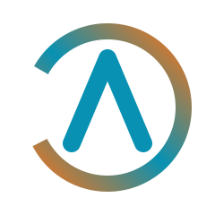

# Altara Energy Logo Files
**Urban Current Edition v2.0 — December 2025**

---

## Logo Files Included

### 1. `altara-logo-standard-v2.svg`
**Description:** Full color logo with gradient orbital ring (orange-teal-orange) and teal "A" symbol  
**Use Cases:**
- Primary use on light backgrounds
- Website homepage and marketing materials
- Social media posts
- Presentations and documents
- Print materials (business cards, flyers, signage)

**Specifications:**
- Orbital ring: Gradient from Ember Orange (#F97316) → Current Teal (#0891B2) → Ember Orange (#F97316)
- "A" symbol: Current Teal (#0891B2)
- Stroke width: 18px (orbital), 20px (A symbol)
- Minimum size: 64px (recommended), 32px (absolute minimum)

---

### 2. `altara-logo-monochrome-white.svg`
**Description:** All-white version for dark backgrounds  
**Use Cases:**
- Dark website backgrounds
- Photography overlays
- Colored backgrounds (especially teal or orange branded backgrounds)
- Video overlays
- Dark mode applications

**Specifications:**
- All elements in white (#FFFFFF)
- Same structure as standard logo
- High contrast for visibility on dark backgrounds

---

### 3. `altara-logo-monochrome-teal.svg`
**Description:** Single-color teal version  
**Use Cases:**
- Single-color reproduction (embroidery, etching, stamps)
- Print materials with limited color budget
- Situations requiring simplified color palette
- Technical documentation
- Architectural drawings

**Specifications:**
- All elements in Current Teal (#0891B2)
- Maintains brand color in single-color contexts

---

### 4. `altara-logo-small-v2.svg`
**Description:** Optimized version for small sizes (under 64px)  
**Use Cases:**
- Favicons (16x16px, 32x32px, 64x64px)
- App icons (iOS, Android)
- Small UI elements
- Social media profile pictures (under 180px)
- Email signatures (40-60px height)

**Specifications:**
- Thicker strokes for better visibility at small sizes
- Orbital ring: 22px stroke width (vs 18px in standard)
- "A" symbol: 24px stroke width (vs 20px in standard)
- Slightly simplified dash pattern for clarity
- Optimized for legibility under 64px

---

### 5. `altara-logo-horizontal-v2.svg`
**Description:** Logo icon with "Altara" wordmark in horizontal lockup  
**Use Cases:**
- Website headers and navigation bars
- Email headers
- Document headers and footers
- Wide format applications (letterhead, banners)
- Social media cover photos

**Specifications:**
- Icon + wordmark in single horizontal lockup
- Wordmark font: Outfit Semi-Bold (600 weight)
- Color: Current Teal (#0891B2)
- Minimum width: 120px (recommended), 180px (optimal for headers)
- Maintains proportional spacing between icon and wordmark

---

## Color Reference

### Urban Current Palette v2.0
- **Current Teal**: `#0891B2` (RGB: 8, 145, 178)
- **Ember Orange**: `#F97316` (RGB: 249, 115, 22)
- **Deep Teal**: `#0E7490` (RGB: 14, 116, 144) - Supporting
- **Bright Orange**: `#FB923C` (RGB: 251, 146, 60) - Supporting
- **White**: `#FFFFFF`

### Gradient Definition (for orbital ring)
```css
linear-gradient(135deg, #F97316 0%, #0891B2 50%, #F97316 100%)
```

---

## Usage Guidelines

### Clear Space
Maintain clear space around the logo equal to the height of the "A" symbol on all sides. This ensures the logo has room to breathe and maintains visual impact.

### Minimum Sizes
- **Icon only**: 32px (absolute minimum), 64px (recommended)
- **Icon with wordmark**: 120px width (minimum), 180-240px (optimal for headers)
- **Print**: 0.5 inch height (icon), 1.5 inches width (horizontal lockup)

### Background Colors
- **Light backgrounds (white, cream, light gray)**: Use `altara-logo-standard-v2.svg`
- **Dark backgrounds (charcoal, slate, black)**: Use `altara-logo-monochrome-white.svg`
- **Teal or orange backgrounds**: Use `altara-logo-monochrome-white.svg`
- **Photography**: Use `altara-logo-monochrome-white.svg` for maximum visibility

### File Format Notes
- **SVG (Scalable Vector Graphics)**: Preferred format for all applications
- SVG files scale infinitely without quality loss
- Work across web, print, and digital applications
- Can be embedded directly in HTML or used as image source
- For raster formats (PNG, JPG): Export from SVG at required resolution

### Converting to Other Formats

**For PNG (with transparency):**
- Use SVG → PNG converter (online tools, Adobe Illustrator, Inkscape)
- Export at 2x or 3x final display size for Retina displays
- Maintain transparent background for flexibility

**For print (PDF, EPS):**
- Open SVG in Adobe Illustrator or Inkscape
- Save as PDF or EPS for professional printing
- Ensure colors are converted to CMYK if required by printer
- Maintain vector format (do not rasterize)

---

## Logo Don'ts

**Never:**
- ❌ Rotate the logo
- ❌ Stretch or distort (always maintain aspect ratio)
- ❌ Change the colors (except approved variants)
- ❌ Add drop shadows, glows, or effects
- ❌ Recreate or redraw the logo
- ❌ Add outlines or borders
- ❌ Use on busy backgrounds that reduce legibility
- ❌ Use smaller than minimum sizes
- ❌ Alter spacing between orbital ring and "A" symbol
- ❌ Rearrange logo elements
- ❌ Combine with other logos without proper separation

---

## Web Implementation

### HTML Image Tag
```html
<!-- Standard logo -->


<!-- Horizontal lockup for header -->

```

### CSS Background Image
```css
.logo {
  background-image: url('altara-logo-standard-v2.svg');
  background-size: contain;
  background-repeat: no-repeat;
  width: 200px;
  height: 200px;
}
```

### Inline SVG (for maximum control)
Copy the SVG code directly into HTML for styling flexibility and animation potential.

### Favicon Implementation
```html
<!-- In <head> section -->
<link rel="icon" type="image/svg+xml" href="altara-logo-small-v2.svg">
<link rel="icon" type="image/png" sizes="32x32" href="favicon-32x32.png">
<link rel="icon" type="image/png" sizes="16x16" href="favicon-16x16.png">
```

---

## Print Specifications

### Business Cards
- Use `altara-logo-standard-v2.svg` or `altara-logo-horizontal-v2.svg`
- Minimum 0.5 inch height for icon-only
- Minimum 1.5 inches width for horizontal lockup
- Convert to CMYK if required by printer

### Signage
- Use `altara-logo-standard-v2.svg` for primary monument signs
- Scale appropriately for viewing distance
- LED-backlit signage: Use white version on colored backgrounds
- Ensure color accuracy in production

### Apparel/Embroidery
- Use `altara-logo-monochrome-teal.svg` for single-color embroidery
- Simplify if necessary for embroidery limitations
- Test on sample fabric before full production

---

## Contact for Brand Assets

For questions about logo usage, requests for additional file formats, or brand guidelines clarification:

**Zak Winnick**  
Founder & CEO, Altara Energy  
zak@altaraenergy.com

---

## Version History

| Version | Date | Changes |
|---------|------|---------|
| 2.0 | December 2025 | Urban Current rebrand - Updated to teal/orange palette from navy/coral |
| 1.0 | November 2025 | Initial Altara brand identity with Ocean Deep/Sunset Coral palette |

---

**Document Version:** 1.0  
**Logo Version:** 2.0 (Urban Current Edition)  
**Last Updated:** December 2025
